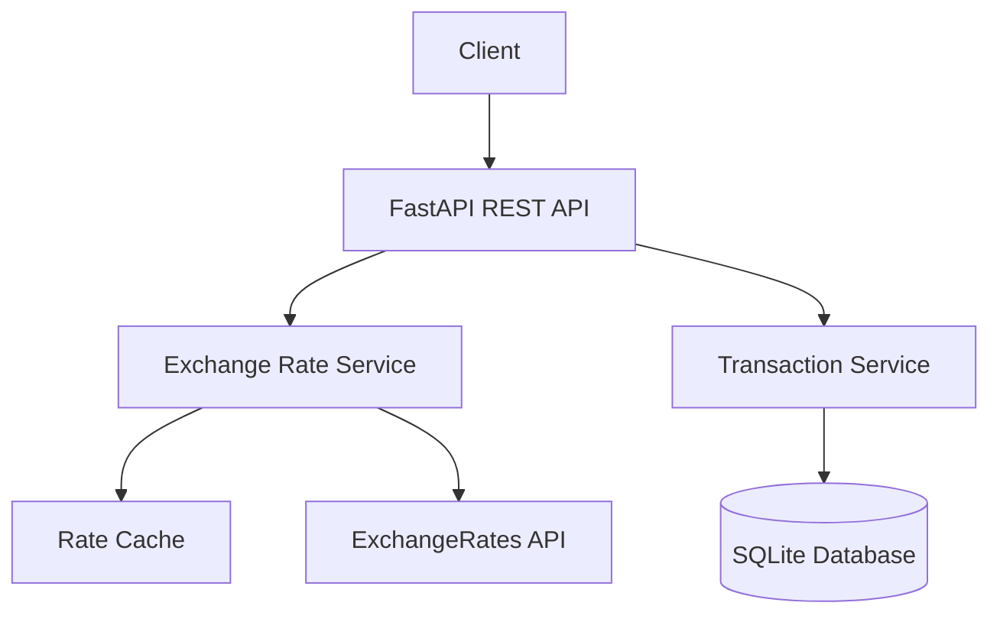

# Currency Exchange API - System Design

## 1. System Architecture

The system follows a clean, layered architecture pattern with the following components:



## 2. Core Components

### 2.1 REST API Layer (FastAPI)
- **Currency Conversion Endpoint**
  ```
  POST /convert
  {
    "user_id": string
    "source_currency": string
    "dest_currency": string
    "amount": decimal
  }
  ```
- **Transaction History Endpoint**
  ```
  GET /transactions/{user_id}
  ```

### 2.2 Data Models

#### Transaction Model
```python
class Transaction:
    id: int                     # Primary Key
    user_id: str               
    source_currency: str        # e.g., "USD"
    dest_currency: str          # e.g., "EUR"
    source_amount: Decimal      # Precise decimal
    dest_amount: Decimal        # Precise decimal
    rate: Decimal              # Exchange rate
    timestamp: datetime        # UTC timestamp
```

## 3. Technical Stack

- **Framework**: FastAPI 0.115+
- **Language**: Python 3.13+
- **Database**: SQLite + SQLAlchemy
- **External API**: exchangeratesapi.io
- **Documentation**: OpenAPI/Swagger
- **Testing**: pytest
- **Validation**: Pydantic

## 4. Core Functionality

### 4.1 Currency Conversion Flow
1. Validate input parameters
2. Check rate cache
3. Fetch current rates if cache expired
4. Perform conversion calculation
5. Store transaction
6. Return result

### 4.2 Data Storage
- SQLite database for transactions
- In-memory cache for exchange rates (10-minute TTL)

## 5. Error Handling

| HTTP Status | Description | Example |
|------------|-------------|----------|
| 400 | Invalid input | Invalid currency code |
| 404 | Resource not found | User not found |
| 429 | Rate limit exceeded | Too many API calls |
| 500 | Internal server error | Database error |

## 6. Security Measures

- Input validation using Pydantic
- Decimal type for monetary values
- Rate limiting
- Error message sanitization
- Logging sensitive data masking

## 7. Project Structure

```
src/
├── api/
│   ├── routes.py          # API endpoints
│   └── dependencies.py    # FastAPI dependencies
├── core/
│   ├── config.py         # Configuration
│   └── exceptions.py     # Custom exceptions
├── models/
│   └── transaction.py    # SQLAlchemy models
├── schemas/
│   └── conversion.py     # Pydantic schemas
├── services/
│   ├── exchange_rate.py  # Rate service
│   └── transaction.py    # Transaction service
└── database/
    └── session.py        # DB configuration
```

## 8. Testing Strategy

### Unit Tests
- Service layer logic
- Model validation
- Currency calculations

### Integration Tests
- API endpoints
- Database operations
- External API integration

## 9. Performance Considerations

### Caching
- Exchange rates cached for 10 minutes
- In-memory cache with TTL
- Fallback mechanism for API failures

### Database
- Indexed queries for transaction history
- Regular cleanup of old records
- Connection pooling

## 10. Monitoring

- Request/response logging
- Error tracking
- Performance metrics
- External API status
- Cache hit/miss ratio

## 11. Future Enhancements

- User authentication
- Support for additional currencies
- Historical exchange rates
- Rate alerts
- Webhook notifications
- Redis-based distributed caching

## 12. Development Setup

```bash
# Environment setup
python -m venv venv
source venv/bin/activate

# Install dependencies
pip install -r requirements.txt

# Run development server
uvicorn src.main:app --reload --port 8000

# Run tests
pytest
```

## 13. API Documentation

API documentation is available at:
- Swagger UI: `/docs`
- ReDoc: `/redoc`

## 14. Dependencies

Core dependencies and their purposes:
- FastAPI: Web framework
- SQLAlchemy: ORM
- Pydantic: Data validation
- requests: HTTP client
- pytest: Testing framework